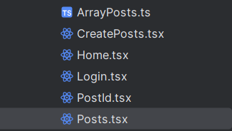
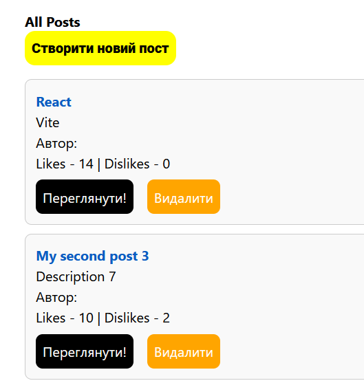
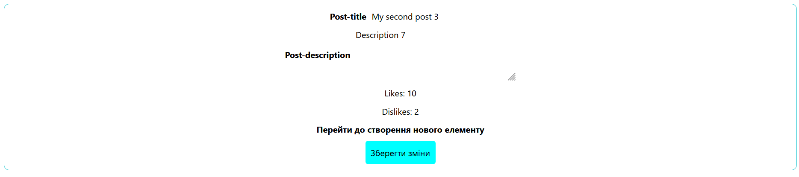
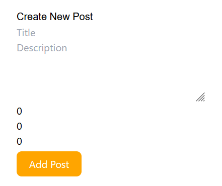

<h2>1. Сторінка колекції екземплярів сутності (<code>/posts</code>)</h2>
<h3>Опис функціоналу</h3>
<ul>
  <li>Відображення списку <strong>всіх доступних постів</strong>.</li>
  <li>Для кожного поста показуються ключові поля:
    <ul>
      <li><code>title</code></li>
      <li><code>author</code></li>
      <li><code>createdAt</code></li>
    </ul>
  </li>
  <li>Кожен пост є посиланням, яке веде на окрему сторінку: <code>/posts/:id</code></li>
  <li>Кнопка <strong>"Створити новий екземпляр"</strong>, яка веде на: <code>/posts/new</code></li>
  <li>Кнопка <strong>"Видалити"</strong> біля кожного поста:
    <ul>
      <li>Перед видаленням з'являється підтвердження дії.</li>
      <li>Після підтвердження — пост видаляється.</li>
    </ul>
  </li>
</ul>
<h3>Скріншоти інтерфейсу</h3>
 
 

<h2>2. Сторінка окремого екземпляра сутності (<code>/posts/:id</code> або <code>/posts/new</code>)</h2>
<h3>Режим перегляду поста (<code>/posts/:id</code>)</h3>
<ul>
  <li> Відображення <strong>повної інформації</strong> про пост.</li>
  <li>Форма для редагування полів (<code>title</code>, <code>content</code> тощо).</li>
  <li> Кнопка <strong>"Update"</strong> для збереження змін.</li>
</ul>
<h3>Режим створення поста (<code>/posts/new</code>)</h3>
<ul>
  <li>Форма з <strong>порожніми полями</strong> для створення нового запису.</li>
  <li>Кнопка <strong>"Create"</strong> для збереження нового поста.</li>
</ul>
<h3> Скріншоти інтерфейсу</h3>
 

